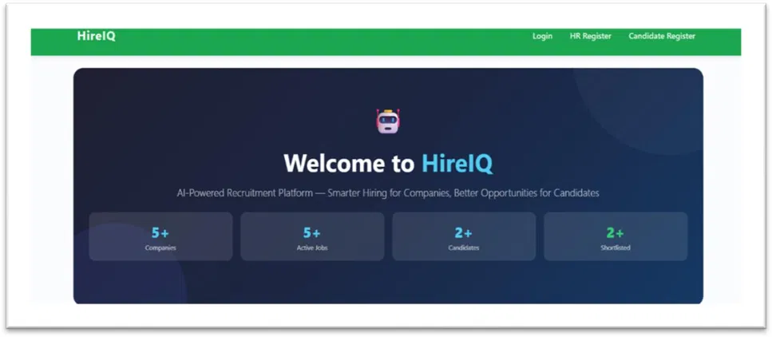
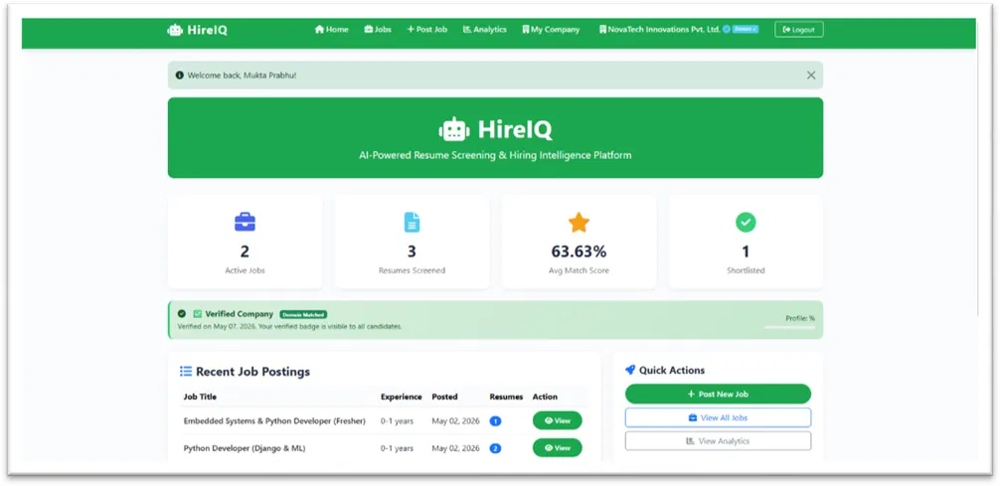
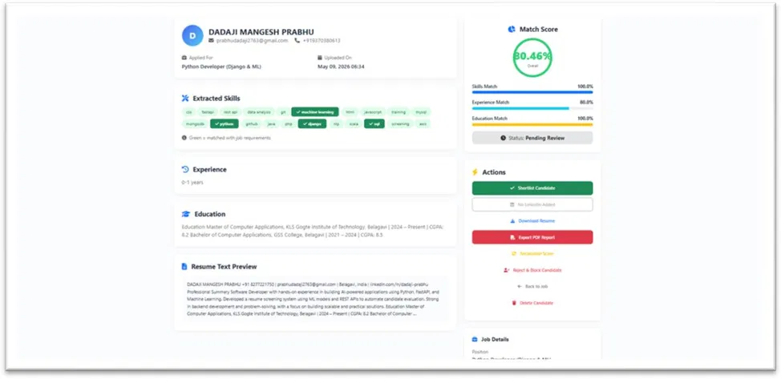
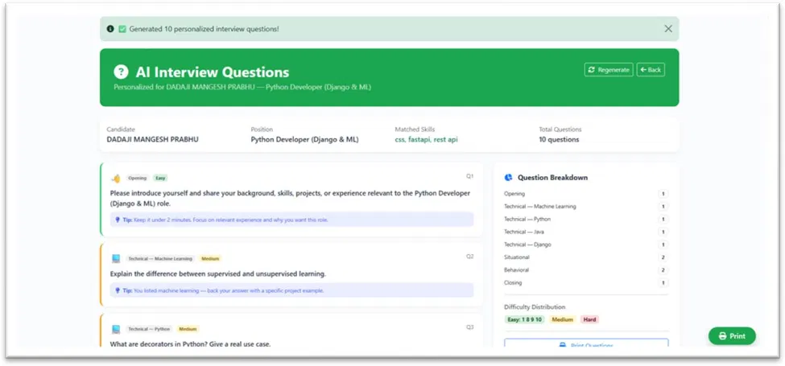
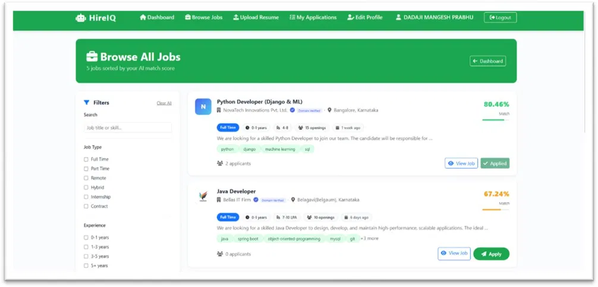

# HireIQ — AI-Powered Recruitment Platform

HireIQ is a full-stack recruitment platform that uses AI/ML to automatically screen resumes, match candidates to jobs, and generate personalized interview questions — built to save recruiters hours of manual resume review.

## Features

- **AI Resume Screening** — parses PDF/DOCX resumes and extracts skills, experience, and education automatically
- **Smart Candidate Matching** — TF-IDF and NLP-based scoring matches candidates to job requirements with a percentage match score
- **AI-Generated Interview Questions** — auto-generates personalized, role-specific interview questions based on candidate skills and the job description
- **Recruiter Dashboard** — post jobs, track applicants, view analytics, shortlist/reject candidates
- **Candidate Portal** — browse jobs sorted by AI match score, track application status, upload/update resume
- **Offer Letter Generation** — auto-generates professional offer letter PDFs
- **OTP Email Verification** — secure company and candidate registration
- **WhatsApp Notifications** — optional application status updates for candidates

## Tech Stack

- **Backend:** Django, Python
- **AI/ML:** scikit-learn (TF-IDF, cosine similarity), spaCy (NLP), PyMuPDF & python-docx (resume parsing)
- **PDF Generation:** ReportLab
- **Frontend:** HTML, CSS, Bootstrap 5, django-crispy-forms
- **Database:** SQLite

## Screenshots

### Recruiter Dashboard

### AI-Powered Candidate Matching

### AI-Generated Interview Questions

### Candidate Job Matching

## How It Works

1. Recruiter posts a job with required skills and experience
2. Candidate uploads their resume (PDF/DOCX)
3. The system parses the resume, extracts skills/education/experience using NLP
4. A match score is calculated against the job requirements using TF-IDF and cosine similarity
5. Recruiters see ranked candidates and can generate AI interview questions or send offer letters directly from the dashboard

## Setup & Installation

Clone the repository, then run:

    python -m venv venv
    source venv/Scripts/activate
    pip install django numpy scikit-learn spacy PyMuPDF python-docx reportlab requests pyotp django-crispy-forms crispy-bootstrap5
    python -m spacy download en_core_web_sm
    python manage.py migrate
    python manage.py runserver

Then visit http://127.0.0.1:8000/ in your browser.

## Author

**Dadaji Prabhu**

[LinkedIn](https://www.linkedin.com/in/dadaji-prabhu/) • [GitHub](https://github.com/Dadaji-Prabhu)
